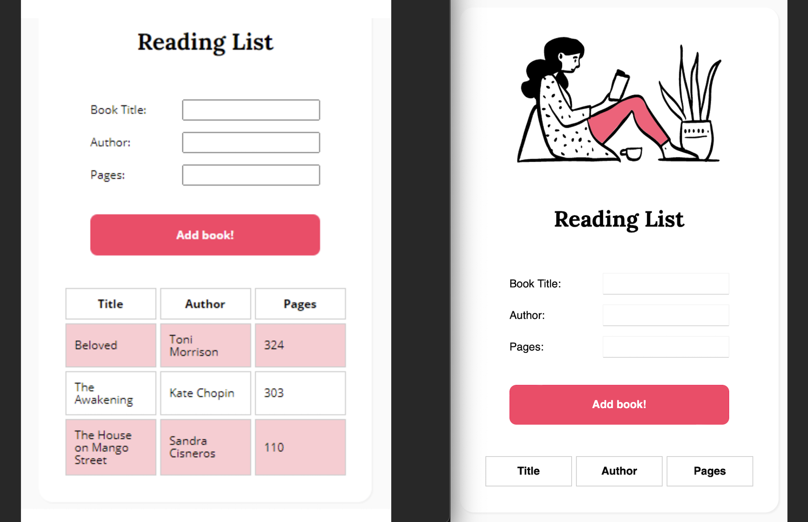

<h1>Reading List Website</h1>

<h2>Description:</h2>

A family member has started programming a reading list website. The goal is to allow users to create a reading list that shows each books’ title, author, and the number of pages in a table format. Unfortunately, the JavaScript isn’t working the way they imagined and they needed help fixing the JS.

After debugging by using the Console and Problems tabs to guide me through fixing the issues, the working website creates a table with alternate row colors when visitors enter the book title, author, and pages.

<h4>JavaScript Toolbox:</h4>

* Factory Functions
* Dot Notation
* Object Literals
* createElement
* innerText, .length 
* addEventListener
* add objects
* arrays, loops
* querySelector()
* Template Literals
* append(), push()
* Debugging 

